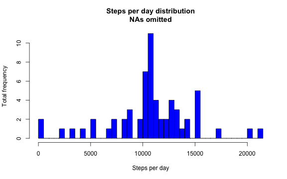
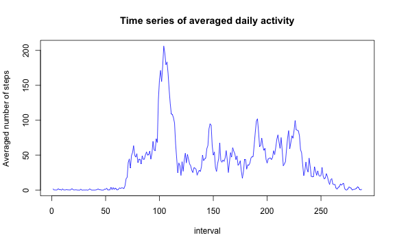
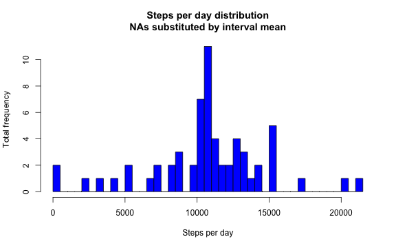
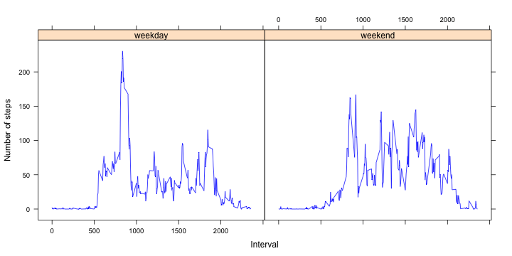

# Reproducible Research: Peer Assessment 1


## Loading and preprocessing the data
We load data as data.frame with appropiate field classes:

```r
setwd("/Volumes/Docs e VTC [Backup]/Docs/_Cursos, Titulacións e Certificacións/coursera.org/Coursera - Reproducible Research/Peer Assessment/Peer Assessment 1/RepData_PeerAssessment1")
# setwd('~/RepData_PeerAssessment1')
data.raw <- read.csv(unzip("activity.zip", "activity.csv"), colClasses = c("numeric", 
    "Date", "numeric"))
str(data.raw)
```

```
## 'data.frame':	17568 obs. of  3 variables:
##  $ steps   : num  NA NA NA NA NA NA NA NA NA NA ...
##  $ date    : Date, format: "2012-10-01" "2012-10-01" ...
##  $ interval: num  0 5 10 15 20 25 30 35 40 45 ...
```

As we may see there is some 'NA' in 'steps' field.


## What is mean total number of steps taken per day?
We remove items with 'NA' values from our dataset:

```r
data <- na.omit(data.raw)
```

To show the total number of steps taken each day we must sum 'steps' field for each day separatedly and then produce histogram:

```r
total.steps.per.day <- sapply(split(data$steps, data$date), sum, simplify = "array")
hist(total.steps.per.day, nclass = length(total.steps.per.day), col = "blue", 
    main = "Steps per day distribution", xlab = "Steps per day", ylab = "Total frequency")
```

 

The mean and median number of steps taken per day is:

```r
summary(total.steps.per.day)[c(4, 3)]
```

```
##   Mean Median 
##  10800  10800
```


## What is the average daily activity pattern?
To elaborate and show this time series we have to select all steps for a given 5-minute interval and calculate the mean including all the days. It has to be applied to all interval in the dataset:

```r
activity <- sapply(split(data$steps, data$interval), mean, simplify = "array")
plot(activity, type = "l", col = "blue", main = "Time series of averaged daily activity", 
    xlab = "interval", ylab = "Averaged number of steps")
```

 

The interval which has higher average steps is:

```r
n_interval_maximum_steps = which(activity == max(activity))
print(n_interval_maximum_steps)
```

```
## 835 
## 104
```

In other words: the 835th element of the series is the 5-minunte interval 104, which as a mean of 206.1698 steps.

## Imputing missing values
To take account of missing values we have to fresh our data set:

```r
data <- data.raw
```

and calculate how many of them are in the original dataset:

```r
# data <- read.csv(unzip('activity.zip', 'activity.csv'),
# colClasses=c('numeric', 'Date', 'numeric'))
n_missing_values <- (dim(data) - dim(na.omit(data)))[1]
print(n_missing_values)
```

```
## [1] 2304
```

As strategy to fill missing values we have chosen to calculate mean steps on each 5-minute interval (for all days). Before filling in our dataset, we create a new data.frame with means by interval:

```r
activity <- sapply(split(data$steps, data$interval), mean, na.rm = TRUE, simplify = "array")
activity.df <- data.frame(cbind(interval = as.numeric(names(activity)), steps = activity))
```

and substitute NAs by these means:

```r
# tmp <- merge.data.frame(data[is.na(data$steps),], activity.df, by.x=3,
# by.y=1) data[is.na(data$steps),]$steps <- tmp$steps.y rm(tmp)
data[is.na(data$steps), ]$steps <- activity.df$steps
```

To calculate and show 
the total number of steps taken each day from the NA-filled dataset:

```r
total.steps.each.day <- sapply(split(data$steps, data$date), sum, simplify = "array")
hist(total.steps.each.day, nclass = length(total.steps.each.day), col = "blue", 
    main = "Steps per day distribution", xlab = "Steps per day", ylab = "Total frequency")
```

 

and we may compare with the histogram calculated before (NAs omitted):  
 

We may say that both figures are similar. In fact calculate a sample mean after have added any number of previously calculaltded mean to the sample does not afect to the result.
Maybe any oder strategy to fill missing values should affect to the sample's distribution, but not ours.
The global mean and median is:

```r
summary(total.steps.each.day)[c(4, 3)]
```

```
##   Mean Median 
##  10800  10800
```

and we may see both are not affected by our strategy.

## Are there differences in activity patterns between weekdays and weekends?
We identify the week days and transform them to "weekend" if they are Saturday or Sunday and "weekday" in other case, add the vector as a new field "weekend" into our dataset:

```r
tmp <- as.POSIXlt(data$date)$wday
tmp <- ifelse(tmp%%6 == 0, "weekend", "weekday")
data <- cbind(data, weekdays = tmp)
rm(tmp)
```

and calculate mean steps for each interval and each of "weekend" or "weekday". To obtain again factors as both fields, we have had to use regular expressions:

```r
average.steps.across.weekdays <- sapply(split(data$steps, list(data$weekdays, 
    data$interval)), mean, simplify = "array")
steps <- as.numeric(grep("[0-9]*", names(average.steps.across.weekdays)))
x <- names(average.steps.across.weekdays)
m <- regexpr("[0-9]{1,}", x)
interval <- as.numeric(regmatches(x, m))
m <- regexpr("[a-z]{7}", x)
weekdays <- regmatches(x, m)
```

and create a data frame to ease plotting:

```r
d <- data.frame(steps = average.steps.across.weekdays, interval = interval, 
    weekdays = weekdays)
library(lattice)
xyplot(d$steps ~ d$interval | d$weekdays, type = "l", col = "blue", xlab = "Interval", 
    ylab = "Number of steps")
```

 


